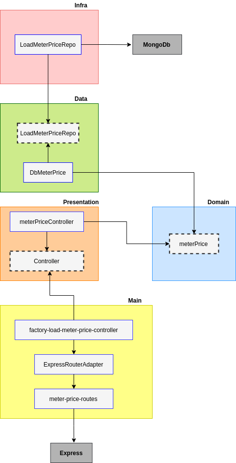

# In-gaia-backend-challenge-**API1**

## API1

Essa api faz parte do desafio backend da empresa [In-Gaia](https://github.com/ingaia/backend-challenge)

O objetivo dessa api é servir o preço do metro quadrado para o usuário.

## Apis contidas nesse repositório

[meter-price](./requirements/meter-price.md)

## Tecnologias utilizadas

  - Typescript
  - NodeJS
  - Jest
  - Supertest
  - Express
  - MongoDb
  - Nodemon
  - Docker
  - Heroku

## Teste de unidade e testes de integração

A API1 utiliza as seguintes ferramentas para testes

  - Jest: framework de teste
  - Jest-mongodb: executa o  banco de dados Mongo em memória
  - supertest: utilizado nos testes de integração, nas rotas http

Executar testes: 

  - **npm run test:unit**
    - Executa os testes unitários

  - **npm run test:integration**
    - Executa os testes de integração

  - **npm run test:ci**
    - Executa os testes de unidade, testes de integração e cobertura de testes

## Instalação e execução da API1

Comandos para instalar e inicializar

 - **npm install**
   - Instala as dependências da api no seu computador
 
 - **npm run up**
   - Executa a api baseado em uma imagem do node 14.x (ver especificação da engine no package.json)
   - Cria um container para a aplicação com o nome **in-gaia-teste-api1-container**
  
Comandos para finalizar a execução

  - **npm run down**
    - Para a execução do container **in-gaia-teste-api1-container**, portanto, desliga a aplicação API1

## Postman

O Postman pode ser utilizado para consumir a api em ambiente local e de produção.

[Collections e environments](./postman)

## Construção da aplicação

A construção da api1 foi feita por camadas, conforme o diagrama abaixo: 

**Leitura do diagrama**

 - A: Camada **presentation**
    - Depende da camada de domínio.
    - Essa camada executa um ou mais casos de uso.
    - Validações de dados podem ser implementadas nessa camada, para garantir boa execução dos casos de uso.
    - Nesta aplicação essa camada apresenta os dados através de uma rota http, do tipo get.

 - B: Camada **domain**
    - Esta camada não depende de nenhuma outra camada da aplicação.
    - Define o model __meter-price__
    - Define o caso de uso para carregar o preço do metro quadrado.
  
 - C: Camada **data**
    - Esta camada depende das fontes de dados da aplicação.
    - Coordena os dados vindos de diferentes fontes de dados.
    - API1 tem uma fonte de dados, o MongoDB.
    - Esta camada utiliza o repositório do MongoDB.

 - D: Camada **infra**
    - Esta camada conhece bibliotecas externas, no caso, o drive do MongoDB.
    - Esta camada implementa os repositórios das fontes de dados, no caso, o MongoDB.
    - Outras bibliotecas, como por exemplo Axios, poderiam ficar nessa camada.
  
 - E: Camada **main**
    - Esta camada depende da camada de apresentação.
    - O servidor web(Express) e as rotas são configurados nessa camada.
    - Esta camada implementa recursos necessários para que as rotas http funcionem.

## Próximos passos

 - Adicionar Swagger ao projeto
 - Processos de CI/CD no Heroku